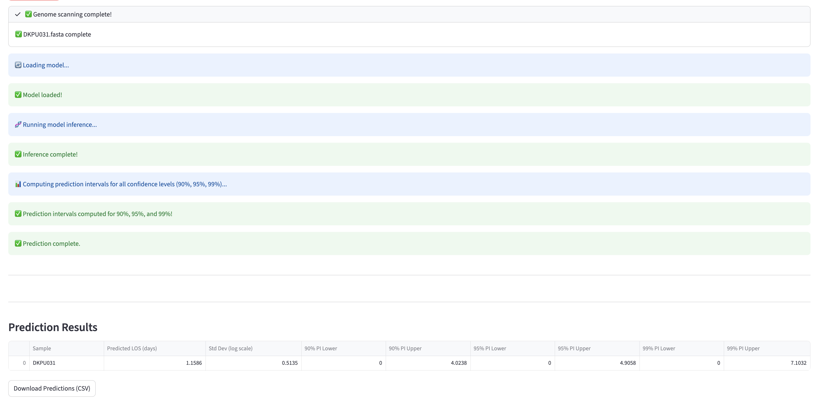
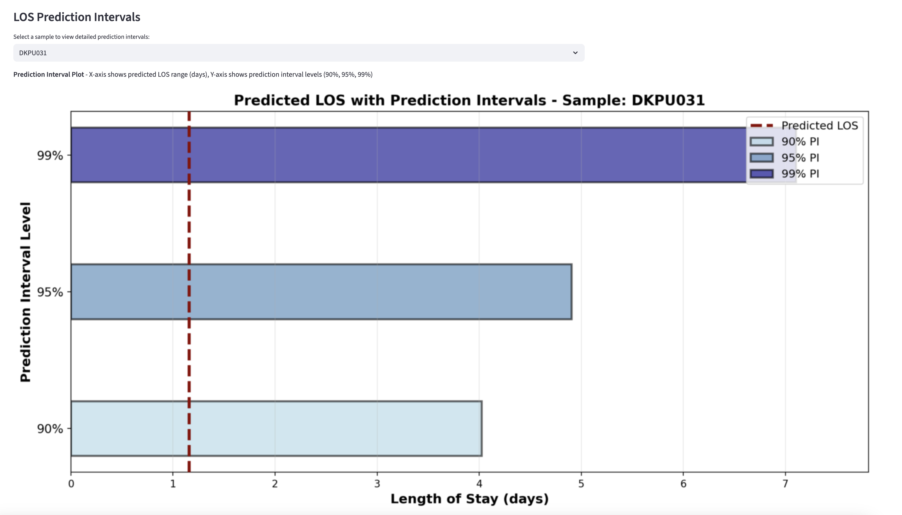
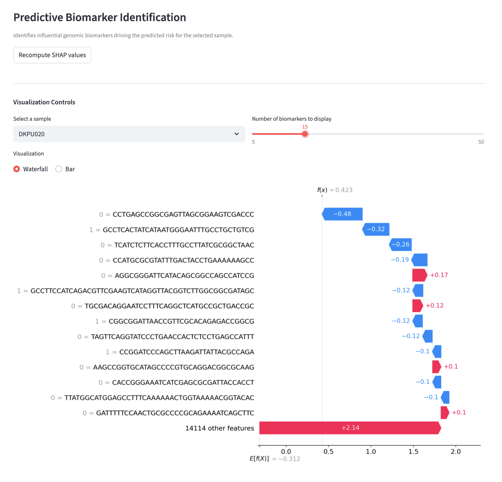
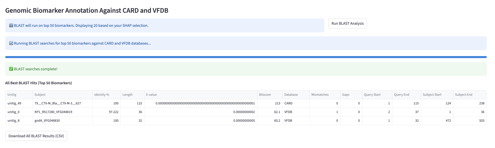

# Machine Learning Based Genomic Risk Prediction

<p align="left">
  
</p>

## Overview

An **machine learning based digital health tool** for predicting **in-hospital mortality** , **ICU admission** and **Length of Stay (LOS)** from bacterial **genomic biomarkers**. This research platform supports **infection prevention** , and data-driven **precision therapeutics** . 

> ⚠️ This platform is intended for **research purposes only** and is **not for clinical decision-making** .

Key features:

- Scan **bacterial genome assemblies (FASTA)** for genomic biomarkers (*unitigs*)  
- Predict **mortality** ,**ICU admission risk** and **Length of Stay (LOS)***
- Compute **approximate 95% confidence intervals (prediction intervals for LOS)** for predictions  
- Optional **SHAP-based biomarker importance visualisation**  
- Parallelised genome scanning for **large datasets**


---

## Installation

### **Docker Usage**

Ensure Docker are installed:

```bash
docker pull hjy1805/ide_app:v2
docker run -p 8501:8501 hjy1805/ide_app:v2
```
If your browser doesn’t automatically open the app page, you can access it at http://0.0.0.0:8501

---

## Project Structure (Docker image)

```plaintext
ide_app/
├── app_v2.py                                   # Main Streamlit app
├── requirements.txt                            # Python dependencies (pip)
├── Unitigs_predictor_DEATH.csv                 # Feature CSV for mortality model
├── Unitigs_predictor_ICU.csv                   # Feature CSV for ICU model
├── Unitigs_predictor_los.csv                   # Feature CSV for LOS model
├── xgb_fold1_8_Death.joblib                    # Pretrained XGBoost mortality model
├── xgb_fold5_8_ICU.joblib                      # Pretrained XGBoost ICU model
├── Unitig_model_ngb_log1p_fold1.joblib         # Pretrained NGBoost LOS model
└── KAUST_Logo.svg                              # Logo for app display
```

## App Workflow

### 1. Select clinical outcome
- **In-hospital Mortality**
- **ICU Admission**
- **Length of Stay (LOS)**

#### Interface for *In-hospital Mortality* and *ICU Admission*
<p align="left">
  
</p>

#### Interface for *Length of Stay (LOS)*
<p align="left">
  
</p>

---

### 2. Upload bacterial genome FASTA files
Accepted formats: `.fa`, `.fasta`, `.fna`, `.fa.gz`, `.fasta.gz`

---

### 3. Adjust optional parameters

#### a. For *In-hospital Mortality* and *ICU Admission*
- Decision threshold (probability cutoff)
- Confidence interval effective **n** (controls CI width)
- Enable SHAP predictive biomarker analysis (optional)

#### b. For *Length of Stay (LOS)*
- Predicts **99%, 95%, and 90% prediction intervals**
- Enable SHAP predictive biomarker analysis (optional)

---

### 4. Run prediction
- Model scans genomes for unitigs
- Generates predicted probability & **95% confidence interval**
- Download results as a **CSV file**

**Example prediction output (for *In-hospital Mortality* and *ICU Admission*):**

<p align="left">
  
</p>

**Example prediction output (for *Length of Stay (LOS)*):**

<p align="left">
  
</p>

<p align="left">
  
</p>

---

### 5. SHAP Visualisation
- Identify the most influential genomic biomarkers
- Show waterfall or bar plots per sample
- Adjust the number of top biomarkers

**Example SHAP output:**

<p align="left">
  
</p>

---

### 6. Genomic Biomarker Annotation Against CARD and VFDB
- Annotates the top predictive genomic unitigs (from SHAP) against two reference databases: CARD (antibiotic resistance genes) and VFDB (virulence factors)

**Example BLAST output:**

<p align="left">
  
</p>

---

## Refernce
Altschul, S.F., Gish, W., Miller, W., Myers, E.W., Lipman, D.J. (1990) “Basic local alignment search tool.” J. Mol. Biol. 215:403-410. doi: 10.1016/S0022-2836(05)80360-2

Chen L, Yang J, Yu J, Yao Z, Sun L, Shen Y, Jin Q. VFDB: a reference database for bacterial virulence factors. Nucleic Acids Res. 2005 Jan 1;33(Database issue): D325-8. doi: 10.1093/nar/gki008. PMID: 15608208; PMCID: PMC539962.

McArthur AG, Waglechner N, et al. The comprehensive antibiotic resistance database. Antimicrob Agents Chemother. 2013 Jul;57(7):3348-57. doi: 10.1128/AAC.00419-13. Epub 2013 May 6. PMID: 23650175; PMCID: PMC3697360.

---

## Contacts
For inquiries regarding this research, please contact:

Jiayi Huang

Email: jiayi.huang@kaust.edu.sa

PhD student

Infectious Disease Epidemiology Lab

Biological and Environmental Science and Engineering (BESE) Division

King Abdullah University of Science and Technology (KAUST)


