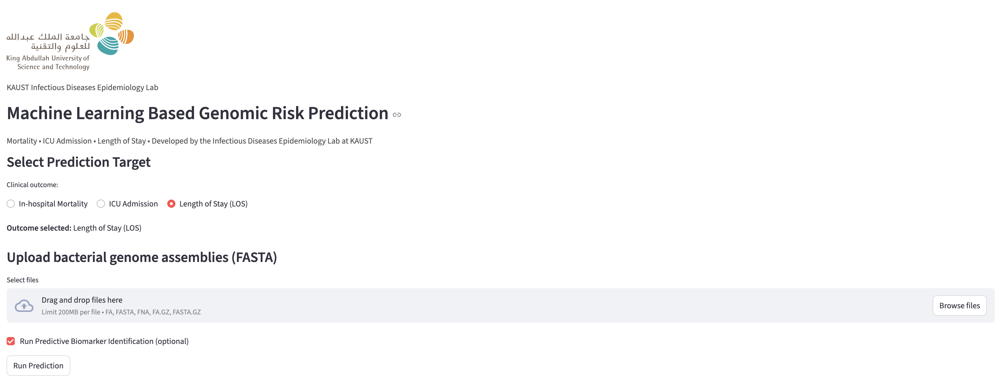

# Machine Learning Based Genomic Risk Prediction

<p align="left">
  
</p>

## Overview

An **machine learning based digital health tool** for predicting **in-hospital mortality**, **ICU admission** and **Length of Stay (LOS)** from bacterial **genomic biomarkers**. This research platform supports **infection prevention** and data-driven **precision therapeutics**.

> ⚠️ This platform is intended for **research purposes only** and is **not for clinical decision-making**.

Key features:

- Scan **bacterial genome assemblies (FASTA)** for genomic biomarkers (unitigs)
- Predict **mortality**, **ICU admission risk** and **Length of Stay (LOS)**
- Compute approximate 95% confidence intervals (prediction intervals for LOS) for predictions
- Optional **SHAP-based biomarker importance visualisation**
- Parallelised genome scanning for large datasets
- **Web interface** via Streamlit for interactive analysis
- **Command-line interface** for batch processing and automation

---

## Package Details

### Prediction Models

- **Mortality**: XGBoost classifier trained on genomic unitigs
- **ICU Admission**: XGBoost classifier trained on genomic unitigs
- **Length of Stay**: NGBoost regressor with natural gradient boosting

### Unitig Features

- a maximal, unambiguous sequence derived from overlapping DNA fragments (k-mers)
- Parallel scanning for efficient processing

### Confidence Intervals

- **Binary predictions**: Wilson interval approximation
- **LOS predictions**: Model-based prediction intervals (90%, 95%, 99%)

### SHAP Analysis

- Explains individual predictions using SHAP values
- Identifies most influential genomic biomarkers
- Supports both waterfall and bar plot visualizations

### BLAST Annotation

- Searches top biomarkers against CARD and VFDB databases
- CARD: Comprehensive Antibiotic Resistance Database
- VFDB: Virulence Factor Database
- Uses BLASTN with default parameters for nucleotide searches

---

## Installation

### **Web Interface (Docker)**

Ensure Docker is installed:

```bash
docker pull hjy1805/ide_app:v2
docker run -p 8501:8501 hjy1805/ide_app:v2
```

If your browser doesn't automatically open the app page, access it at http://0.0.0.0:8501

### **Command-Line Interface (CLI)**

```bash
git clone https://huggingface.co/hjy1805/Kp_prediction_cli
cd Kp_prediction_cli
```

#### Prerequisites

Ensure you have Python 3.8+ installed with required packages:

```bash
pip install -r requirements.txt
```

On Linux systems, also ensure BLAST tools are installed (conda command provided below, offical documentation please refer to https://blast.ncbi.nlm.nih.gov/doc/blast-help/downloadblastdata.html):

```bash
# Conda
conda install -c bioconda blast
```

#### Make Scripts Executable

```bash
chmod +x cli_wrapper.py
chmod +x predict_cli.sh
```

---

## Project Structure

```
Kp_prediction_cli/
├── cli_wrapper.py                             # Command-line interface wrapper
├── predict_cli.sh                             # Shell script launcher for CLI
├── requirements.txt                           # Python dependencies
├── Unitigs_predictor_DEATH.csv                # Death prediction unitigs
├── Unitigs_predictor_ICU.csv                  # ICU prediction unitigs
├── Unitigs_predictor_los.csv                  # LOS prediction unitigs
├── xgb_fold1_8_Death.joblib                   # Death prediction model
├── xgb_fold5_8_ICU.joblib                     # ICU prediction model
├── Unitig_model_ngb_log1p_fold1.joblib        # LOS prediction model
├── CARD.fasta                                 # CARD antibiotic resistance database
└── VFDB.fasta                                 # VFDB virulence factor database
```

---

## Usage

### Web Interface (Interactive)

#### 1. Select clinical outcome
- **In-hospital Mortality**
- **ICU Admission**
- **Length of Stay (LOS)**

#### Interface for *In-hospital Mortality* and *ICU Admission*
<p align="left">
  
</p>

#### Interface for *Length of Stay (LOS)*
<p align="left">
  
</p>

#### 2. Upload bacterial genome FASTA files
Accepted formats: `.fa`, `.fasta`, `.fna`, `.fa.gz`, `.fasta.gz`

#### 3. Adjust optional parameters

**For *In-hospital Mortality* and *ICU Admission*:**
- Decision threshold (probability cutoff)
- Confidence interval effective **n** (controls CI width)
- Enable SHAP predictive biomarker analysis (optional)

**For *Length of Stay (LOS)*:**
- Predicts **99%, 95%, and 90% prediction intervals**
- Enable SHAP predictive biomarker analysis (optional)

#### 4. Run prediction
- Model scans genomes for unitigs
- Generates predicted probability & **95% confidence interval**
- Download results as a **CSV file**

**Example prediction output (for *In-hospital Mortality* and *ICU Admission*):**

<p align="left">
  
</p>

**Example prediction output (for *Length of Stay (LOS)*):**

<p align="left">
  
</p>

<p align="left">
  
</p>

#### 5. SHAP Visualisation
- Identify the most influential genomic biomarkers
- Show waterfall or bar plots per sample
- Adjust the number of top biomarkers

**Example SHAP output:**

<p align="left">
  
</p>

#### 6. Genomic Biomarker Annotation Against CARD and VFDB
- Annotates the top predictive genomic unitigs (from SHAP) against two reference databases: CARD (antibiotic resistance genes) and VFDB (virulence factors)

**Example BLAST output:**

<p align="left">
  
</p>

### Command-Line Interface (Batch Processing)

The CLI wrapper allows running predictions from the command line without the web interface. Useful for:

- **Batch processing** of multiple genomes
- **High-performance computing** (HPC) cluster integration
- **Automated pipelines** and workflows
- **Server deployment** without GUI dependencies

#### Quick Start

**Mortality Prediction:**
```bash
python3 cli_wrapper.py -i genome1.fasta genome2.fasta -o results.csv -t death
```

**ICU Admission Prediction:**
```bash
python3 cli_wrapper.py -i genomes/*.fasta -o icu_results.csv -t icu
```

**Length of Stay (LOS) Prediction:**
```bash
python3 cli_wrapper.py -i sample.fasta -o los.csv -t los
```

**Using the Shell Script Wrapper:**
```bash
./predict_cli.sh -i genome.fasta -o predictions.csv -t death
```

#### Full Command Reference

**Required Arguments:**
```
-i, --input FILE [FILE ...]    Input FASTA files (supports wildcards)
-t, --outcome {death,icu,los} Prediction outcome
```

**Optional Arguments:**
```
-o, --output FILE             Output CSV file (default: predictions.csv)
--threshold FLOAT             Decision threshold (default: 0.5, not effective for LOS prediction)
--n-eff INTEGER               CI effective n (default: 200, not effective for LOS prediction)
--shap                        Enable SHAP analysis
--top-biomarkers INTEGER      Top N biomarkers (default: 20)
--blast                       Enable BLAST annotation
--shap-output FILE            SHAP output filename
--blast-output FILE           BLAST output filename
-h, --help                    Show help message
```

#### Examples

**Complete Analysis with BLAST Annotation:**
```bash
python3 cli_wrapper.py \
  -i samples/*.fasta \
  -o predictions.csv \
  -t death \
  --shap \
  --top-biomarkers 50 \
  --blast \
  --shap-output top_biomarkers.csv \
  --blast-output annotations.csv
```

**Batch ICU Prediction with Custom Threshold:**
```bash
python3 cli_wrapper.py -i genomes/*.fasta -o icu.csv -t icu --threshold 0.6 --n-eff 300
```

#### Output Files

**Predictions CSV:**
- Binary outcomes: Sample, Predicted_Probability, CI_95_Lower, CI_95_Upper, Prediction
- LOS: Sample, Predicted_LOS_days, prediction intervals (90%, 95%, 99%)

**SHAP Results CSV:**
- Sample, Rank, Biomarker, SHAP_Value, SHAP_Abs

**BLAST Results CSV:**
- Unitig_Sequence, Subject, Identity_pct, Evalue, Bitscore, Database

---


## Troubleshooting

### BLAST Not Available

Install BLAST tools:

```bash
# Linux
sudo apt-get install ncbi-blast+

# macOS
brew install blast
```

### Memory Issues

Process files in smaller batches or increase available memory.

### Docker Issues

Ensure port 8501 is available and not blocked by firewall.

---

## Refernce

Chen T, He T, Benesty M, Khotilovich V, Tang Y, Cho H, Chen K, Mitchell R, Cano I, Zhou T, Li M, Xie J, Lin M, Geng Y, Li Y, Yuan J, Cortes D (2025). xgboost: Extreme Gradient Boosting. R package version 3.2.0.0, https://github.com/dmlc/xgboost

Tony Duan, Anand Avati, Daisy Yi Ding, Khanh K. Thai, Sanjay Basu, Andrew Y. Ng, Alejandro Schuler. 2019. NGBoost: Natural Gradient Boosting for Probabilistic Prediction https://dl.acm.org/doi/10.5555/3524938.3525190

Altschul, S.F., Gish, W., Miller, W., Myers, E.W., Lipman, D.J. (1990) “Basic local alignment search tool.” J. Mol. Biol. 215:403-410. doi: 10.1016/S0022-2836(05)80360-2

Chen L, Yang J, Yu J, Yao Z, Sun L, Shen Y, Jin Q. VFDB: a reference database for bacterial virulence factors. Nucleic Acids Res. 2005 Jan 1;33(Database issue): D325-8. doi: 10.1093/nar/gki008. PMID: 15608208; PMCID: PMC539962.

McArthur AG, Waglechner N, et al. The comprehensive antibiotic resistance database. Antimicrob Agents Chemother. 2013 Jul;57(7):3348-57. doi: 10.1128/AAC.00419-13. Epub 2013 May 6. PMID: 23650175; PMCID: PMC3697360.

---

## Contact

For inquiries regarding this research, please contact:

Jiayi Huang

Email: jiayi.huang@kaust.edu.sa

PhD student

Infectious Disease Epidemiology Lab

Biological and Environmental Science and Engineering (BESE) Division

King Abdullah University of Science and Technology (KAUST)
